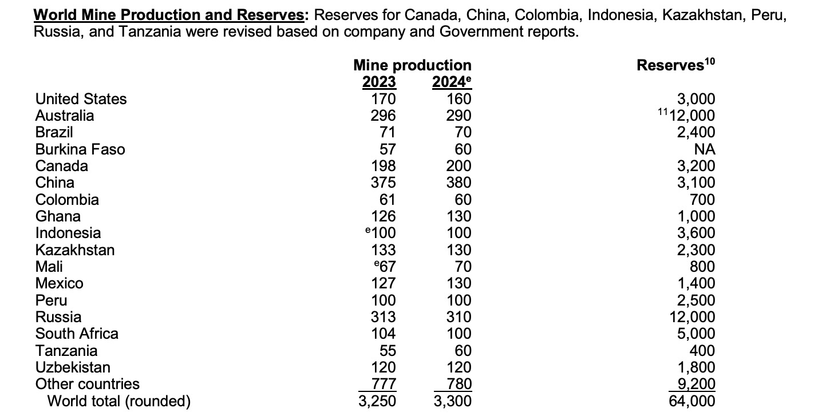

## Video and Codebase links:


##### Video
The link to the code overview is below, also an embedded video added for convenience.  
[Mid Project Youtube Link](https://www.youtube.com/watch?v=vorvYnRlsmo)

##### Code base
The code base for this project can be found on github.  
[https://github.com/jonathan-dale/stat-515](https://github.com/jonathan-dale/stat-515)

#### Mid project youtube embedded video


> How to add embedded videos: https://quarto.org/docs/authoring/markdown-basics.html#videos


## Midterm Redesign code overview.
This page provides a brief overview of the code used to generate the Gold Reserves mid term project.  
We first load libraries and packages that will be needed.

```{r setup}
#| label: setup
#| include: true

library(tidyverse)
library(dbplyr)
library(scales)
library(maps)   # for map_data()
```


I created a csv file by copying the data found in the USGS January 2025 report on page 83 to my clipboard. As you can see in the image below, the original chart includes commas as thousands separators and superscript markers in the Reserves column and elsewhere. This makes it difficult to import cleanly into a data frame with `read_csv()` in R. To obtain a clean csv file used to load the data into R, I used Claude to generate a proper csv file used in all fo the rest of this report. 





## Load data
After creating the proper data.csv file with the data referenced in the original source image, the csv file loads into a data frame with no issues.  
```{r data loading}
#| label: data loading
#| include: true
#| echo: true

# Read the csv into a data frame then build plots by layering ggplot() + geom_*() (histogram, bar, box, ect.) use coord_flip() for horizontal versions.

# Begin by loading the data from the csv file. 
df <- read_csv("../data/data.csv")
# head(df)   # Not as useful as the glimpse() function below...

# This will give you the column names and types so you know what to plot.
glimpse(df)

```

Analysis of the data shows that we have at least one NA value that should be removed; it also contains a mix of categorical values (Countries) and a few numeric measures. This leads well to bar-like ranking and change over time charts.
Lets try to create a single year reserve chart using either bar


## Data inspection and cleaning
The data set has at least one NA values that should be removed, also remove NA values and also the last row titled "World total".
```{r exploration}
#| label: data exploration and cleaning
#| include: true
#| echo: true


# Count the total number of missing values
na_val = sum(is.na(df))
cat("Number of missing data (n/a): ", na_val, "\n")

# Count missing values in each column
cat("A summary of missing data below:", "\n")
colSums(is.na(df))

# Get a summary of the data including NA counts
# summary(df)

# Create a filtered tibble removing NA and "World total...."
# Also arrange by descending order
df_clean = df %>%
  filter(
    !Country == "World total (rounded)",
    !is.na(Reserves)
  ) %>%
  arrange(desc(Reserves))
df_clean


# Print the clean data frame renamed as reserves
# print(df_clean)
glimpse(df_clean)
colSums(is.na(df_clean))
```


## Redesigning the original image
Redesigning the original image will be done using `ggplot2` with a base layer of the clean data frame and then incrementally adding layers to it.
> Read the csv into a data frame then build plots by layering ggplot() + geom_*() (histogram, bar, box, ect.)
 use coord_flip() for horizontal versions.


Creating some basic plots using the data frame. 

```{r basic plots}
#| label: basic_plots
#| include: true
#| echo: true


# Simple plot 1
ggplot(df_clean, aes(x = Reserves, y = Country)) +
  geom_bin_2d() +
  labs(
    title = "Simple plot",
    y = "Country",
    x = "Reserves"
  ) +
  theme_light()

# Simple plot 2
ggplot(df_clean, aes(Reserves, Country)) +
  geom_count() +
  labs(
    title = "Simple plot",
    y = "Country",
    x = "Reserves"
  ) +
  theme_light()


################################################################################
#  Pipe the data frame directly into ggplot function after mutating to plot
df %>%
  mutate(!is.na(Reserves)) %>%
  filter(!Country == "World total (rounded)") %>%
  ggplot(aes(x = reorder(Country, Reserves), y = Reserves, fill = Reserves)) +
  geom_col() +
    labs(
      title = "Reserves distribution",
      x = "Country",
      y = "Reserves"
    ) +
    theme_minimal()


## As you can see, the country name in the x axis is not easy to see, this can be adjusted by using a coord_flip().


#  Pipe the data frame directly into ggplot function after mutating to plot
df %>%
  mutate(!is.na(Reserves)) %>%
  filter(!Country == "World total (rounded)") %>%
  ggplot(aes(x = reorder(Country, Reserves), y = Reserves, fill = Reserves)) +
  geom_col() +
  coord_flip() +
    labs(
      title = "Reserves distribution",
      x = "Country",
      y = "Reserves"
    ) +
    theme_minimal()

```

This chart looks promising however if you look close, you can spot one small issue. The data set used to generate the plot includes all values except those with name matching the string "World total (rounded)". In this case we included a country with a null value in the "Reserves" column, "Burkina Faso". A good way to address this issue, among many, is to use the clean data frame that was created in the first section. Recall the filter `!is.na(Reserves)` on the "Data inspection and cleaning" section above removed any NA values from the Reserves column. 
This clean data frame will be used in the following section to prevent confusion. 


### Final redesign
Create the final redesign image using ggplot
```{r final-design}
#| label: Final redesign
#| include: true
#| echo: true
#| fig-cap: "Deposits that could be economically extracted or produced by country (metric tons)."


## Redesign the original image

# Begin with the clean data frame 'df_clean'
# Plot reserves by country 
# Sort countries by their reserve values
# Color bars by the same reserve values.
# Use the 'viridis' scale for color based on Reserves.

df_clean %>%
  ggplot(aes(x = reorder(Country, Reserves), y = Reserves, fill = Reserves)) +
  geom_col() +
  geom_text(
    aes(label = paste0(df_clean$Reserves)),
    hjust = -0.05,
    size = 3.2,
    color = "gray20"
  ) +
  scale_fill_continuous(type = "viridis", name = "Reserves") +
  scale_y_continuous(labels = comma, expand = expansion(mult = c(0, 0.10))) +
  coord_flip() +
  labs(
    title = "Unmined Reserves of Gold",
    subtitle = "Deposits that could be economically extracted or produced.",
    x = NULL,
    y = "Reserves (metric tons)"
  ) +
  theme_minimal()
ggsave("final.png")
# ggsave("final_plot.png", width = 5, height = 5)
# Saves last plot as 5’ x 5’ file named "plot.png" in working directory.
# https://posit.co/wp-content/uploads/2022/10/data-visualization-1.pdf

```

This image uses the Viridis color palette, which is perceptually uniform and suitable for colorblind viewers.
<!--source: https://www.r-bloggers.com/2023/11/colour-gradient-scale-with-scale_fill_gradientn-in-r/-->


## Looking for trends in the data
Visualize how mine production changed from 2023 to 2024 for each country. The extreme value "World total (rounded)" throws off the scale. This extreme value has been removed in the second image by starting with the clean data set.

```{r change-23-24}
#| label: change-23-24
#| include: true
#| echo: true
#| fig-cap: "Change in gold mine production from 2023 to 2024 by country (metric tons)."


# Mutate the original data frame with out reassigning it, create new column "Change_23_24"
# Pass the mutated object directly into the ggplot.
# Create vertical histogram by using coord_flip

df %>%
  filter(!is.na(Production_2023), !is.na(Production_2024)) %>%
  mutate(Change_23_24 = Production_2024 - Production_2023) %>%
  ggplot(aes(x = reorder(Country, Change_23_24),
             y = Change_23_24,
             fill = Change_23_24 > 0)) +
  geom_col() +
  coord_flip() +
  scale_fill_manual(
    values = c("TRUE" = "darkgreen", "FALSE" = "firebrick"),
    name   = "Change",
    labels = c("FALSE" = "Decrease or no change", "TRUE" = "Increase")
  ) +
  labs(
    title = "Change in gold mine production, 2023 to 2024",
    subtitle = "Original data set",
    x = "Country",
    y = "Change in mine production (metric tons)"
  ) +
  theme_minimal()


# Removing the World Total by using the clean data frame (df_clean), now the trends are much easier to see in the image.
# Using the same code as above except starting with the clean data set
df_clean %>%
  mutate(Change_23_24 = Production_2024 - Production_2023) %>%
  ggplot(aes(x = reorder(Country, Change_23_24),
             y = Change_23_24,
             fill = Change_23_24 > 0)) +
  geom_col() +
  coord_flip() +
  scale_fill_manual(
    values = c("TRUE" = "darkgreen", "FALSE" = "firebrick"),
    name   = "Change",
    labels = c("FALSE" = "Decrease or no change", "TRUE" = "Increase")
  ) +
  labs(
    title = "Change in gold mine production, 2023 to 2024",
    subtitle = "Outliers removed, clean data set",
    x = "Country",
    y = "Change in mine production (metric tons)"
  ) +
  theme_minimal()
```


## Using map layers to visualize locations
Lets try to use map layers discussed in the class to visualize a location on the globe instead of a simple flag as seen in the original image.


```{r}
#| label: Map layer graphics
#| include: true
#| echo: true
#| fig-cap: "Map layers"

world_tbl = map_data("world") %>% as_tibble()
glimpse(world_tbl)

## Notice the region value is not the same as our data set "Region"


```


