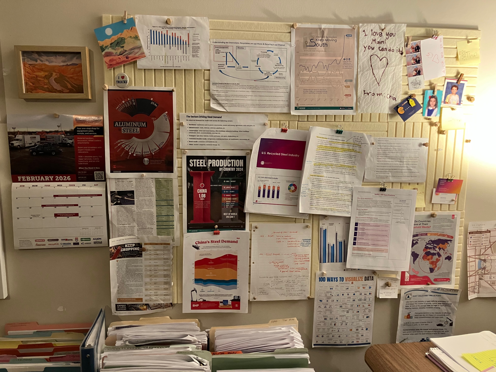
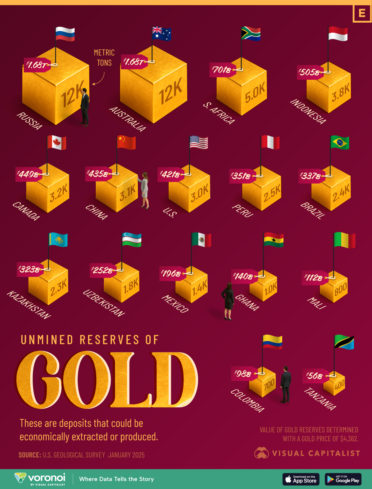
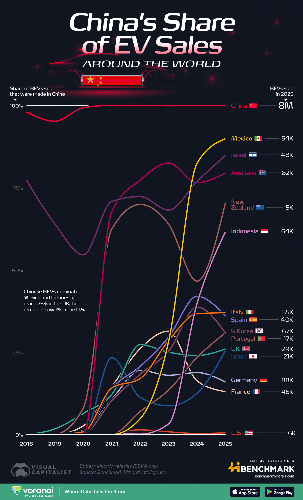

## Introduction

The dynamics of the global gold market is governed by not only the above-ground stock but also the geographic distribution of reserves in the ground which are yet to be extracted. According to recent estimates from the U.S. Geological Survey (USGS), the amount of proven gold reserves total on the order of tens of thousands metric tons worldwide with substantial concentrations among just a limited number of producers. 

In a 2025 visualization published by Visual Capitalist, nations are ranked by their un-mined gold reserves using the data from the USGS estimate in order to illuminate the perspective geography of future extraction. While the original image is visually engaging and communicates the basic ranking of nations, the design makes it difficult to extract precise quantitative comparisons. It falls short of an analytical instrument and is not sophisticated enough to provide the level of accuracy required for through analysis.


In this project, we will address those limitations through systematic reconstruction of the original design using data from the Mineral Commodity Summaries 2025 published by the USGS, we source the exact data cited in the original graphic. 


<!-- The report is accompanied by descriptive statistical summaries, analysis and visualizations redesigned using R using r-markdown. -->


## The image selection

For this project I drew inspiration from my fiancee Emily's home office, where she conducts research on economic markets. As a professional economist she frequently works with data-rich visual resources. Among these, one particularly influential source was [Elements](https://elements.visualcapitalist.com/), a platform that uses data visualization to explore the relationship between global trends and the natural resources behind them.




## Overview

This project is a recreation of the **"Unmined Reserves of Gold"** info graphic (shown below) using **ggplot2**. The original shows estimated gold reserves by country displayed in metric tons and valued in USD determined by a gold price factor of $4,362 per troy ounce. 


### Original image design
In the original image titled, **"Ranked: Unmined Gold Reserves by Country"**, the graphic presents a detailed comparison of countries' unmined gold reserves, ranked by estimated weight. The figure reports reserves in metric tons and also provides an inferred monetary value for these reserves, calculated using a pegged gold price of $4,362 per unit. 

##### Original image:


TODO: figure out how make the image smaller, its taking up the entire page, more than one fold. Needs to be shorter at least.

#### Data source
As you can see in the original graphic, the data source references the [U.S Geological Survey Janurary 2025](https://pubs.usgs.gov/periodicals/mcs2025/mcs2025.pdf). In the reports table of content, a section reporting gold is found on page 83 directly after germanium. On the following page, a table is displayed which includes the [data](../data/data.csv) used for this project. I copied the data from the report and created a file named data.csv which contains the following columns for the following:  
`country name, production for both years 2023, 2024, and total reserves`


<!-- >  "World Mine Production and Reserves: Reserves for Canada, China, Colombia, Indonesia, Kazakhstan, Peru, -->
<!-- Russia, and Tanzania were revised based on company and Government reports. " -->
<!-- The text above is clearly displayed in the image, no need for duplication.  -->


## Observations
Some observations about the original graphic, data, likely conclusions that can be inferred.


## Data preparation
The data included 19 samples of 4 measurements. As you can see, the data contains NA values we will need to remove, and also last row, "World total" which is not included in the original image.

#### The Data

```{r}
print(df)

# TODO: this dose not render, need to figure out how to include images created in the CODE file
```


## Recap

## Conclusion


## Source

- **Data:** U.S. Geological Survey, January 2025; value of reserves at gold price $4,362/troy oz.
- **Original info graphic:** Visual Capitalist [reference image](../images/GoldDepositFooters.jpg).


## Next image redesign 




This image looks like a good candidate to include for a simplification, its a little messy.  
[Chinas share of EV's world wide](https://elements.visualcapitalist.com/where-chinese-evs-are-selling-the-most-worldwide/)


