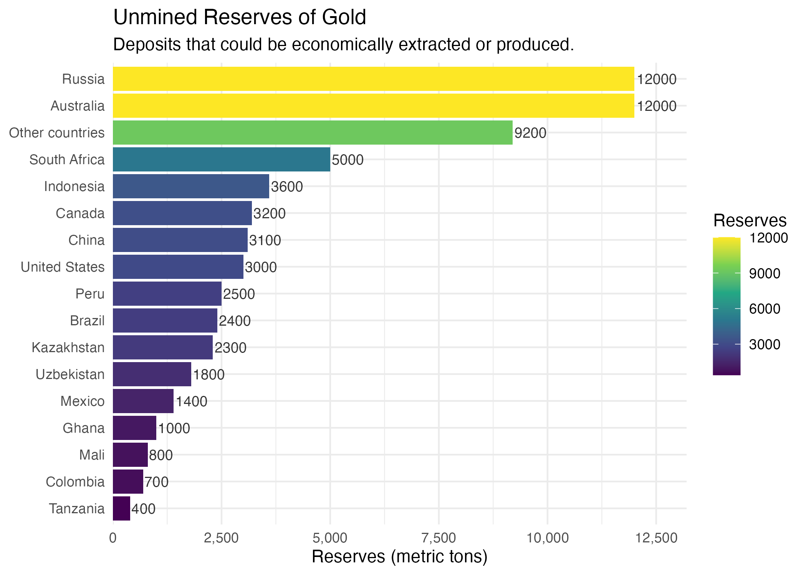

## Introduction

The dynamics of the global gold market is governed by not only the above-ground stock but also the geographic distribution of reserves in the ground which are yet to be extracted. According to recent estimates from the U.S. Geological Survey (USGS), the amount of proven gold reserves total on the order of tens of thousands metric tons worldwide with substantial concentrations among just a limited number of producers. 

In a 2025 visualization published by Visual Capitalist, nations are ranked by their un-mined gold reserves using the data from the USGS estimate in order to illuminate the perspective geography of future extraction. While the original image is visually engaging and communicates the basic ranking of nations, the design makes it difficult to extract precise quantitative comparisons. It falls short of an analytical instrument and is not sophisticated enough to provide the level of accuracy required for through analysis.

In this project, I will address those limitations through systematic reconstruction of the original design using data from the Mineral Commodity Summaries 2025 published by the USGS, the exact data cited as the source in the original graphic. 

## The image selection

For this project I drew inspiration from my fiancee Emily's home office, where she conducts research on economic markets. As a professional economist she frequently works with data-rich visual resources. Among these, one particularly influential source was [Elements](https://elements.visualcapitalist.com/), a platform that uses data visualization to explore the relationship between global trends and the natural resources behind them.

## Project Overview

This project is a recreation of the **"Unmined Reserves of Gold"** info graphic (shown below) using **ggplot2**. The original shows estimated gold reserves by country displayed in metric tons and valued in USD determined by a gold price factor of $4,362 per troy ounce. 

### Original image design
In the original image, **"Ranked: Unmined Gold Reserves by Country"**, the graphic presents a detailed comparison of countries' unmined gold reserves, ranked by estimated weight using 3D cubes of various sizes that represent the amount of unmined gold in each country. Each cube include a flag at the top representing the country, and a price tag around the flag pole indicating the dollar value of the gold after mining. The figure reports reserves in metric tons and also provides an inferred monetary value for these reserves, calculated using a pegged gold price of $4,362 per unit. Russia and Australia are tied as the top countries each with an gold reserve of 12,000 metric tons each.

##### Original image:
{width=60%}

<!-- TODO: figure out how make the image smaller, its taking up the entire page, more than one fold. Needs to be shorter at least. -->

#### Data source
As you can see in the original graphic, the data source references the [U.S Geological Survey Janurary 2025](https://pubs.usgs.gov/periodicals/mcs2025/mcs2025.pdf). In the reports table of content, a section reporting gold is found on page 83 directly after germanium. On the following page, a table is displayed which includes the [data](../data/data.csv) used for this project. I copied the data from the report and created a file named data.csv which contains the following columns for the following:  
`country name, production for both years 2023, 2024, and total reserves`

{width=85%}

## Observations
The initial observation about the original graphic include its attention grabbing aspects. While this is visually appealing for the cover of a publication, magazine, or website, a "less is more" design may help the reader analyse the information better. Naturally one can conclude that the unmined gold per country seems to be concentrated but the extent is hard to gauge and the information would be better plotted as stacks bars representing each country. The sub caption "deposits that could be economically extracted..." indicates that these reserves are proven, however the underling data seem to indicate that these "reserves" are only estimates, not proven.

One might be able to couple well with other sources of related information, for example: 
- central bank gold purchases per year (or change year over year)
- gold reserves held by country

### The data
Errors found in the data: Indonesia reports reserves of 3.6K however the image displays 3.8K.  
Also note that the original info graphic includes data for a single year however the data we pulled from the source, Mineral Commodity Summaries 2025, includes production for years 2023-24 as well as the reserves. 

## Data preparation
The data included 19 samples of 4 measurements. As you can see, the data contains NA values we will need to remove, and also last row, "World total" which is not included in the original image.

## Final Redesign
The redesigned image is easy to read with a natural top down left to right flow. The image uses the "Viridis" color palette, which is perceptually uniform and suitable for colorblind viewers and also lends to a classic design. 

## Recap
The project covers the redesign of an original data visualization in order to display our competency in many of the topics covered in the STATS 515 course like data cleaning, analysis and design using the packages available with R code. The ggplot2 package is key part of R and makes it easy to display data with many different layers that can build up to a complete picture and inform the reader with ease. 

## Conclusion
This original image from [Elements Visual Capitalist](https://elements.visualcapitalist.com/) is visual appealing though too busy to find meaning full information hidden in the data with ease. The redesign helps to simplify the messages that are not so simply seen in the data with a simple look. 

## Source

- **Data:** U.S. Geological Survey, January 2025; value of reserves at gold price $4,362/troy oz.
- **Original info graphic:** Visual Capitalist [reference image](../images/GoldDepositFooters.jpg).

<!-- # TODO: Move the following section to separate page -->
<!-- ##### Image choice

> The image selection for this image redesign project was harder than expected. With every visit to [Elements](https://elements.visualcapitalist.com/) I found so many good images, a few of the candidates are displayed below.

::: {layout-nrow=2}
[{width=35%}](https://elements.visualcapitalist.com/where-chinese-evs-are-selling-the-most-worldwide/)

[{width=40%}](https://elements.visualcapitalist.com/mapped-which-countries-hold-the-most-gold/)

[{width=40%}](https://elements.visualcapitalist.com/sizing-up-the-oil-market-vs-top-10-metal-markets-combined/)

[{width=40%}](https://elements.visualcapitalist.com/the-worlds-top-resource-giants-ranked-by-wealth-per-capita/)
::: 

[linked-figures (quarto docs)](https://quarto.org/docs/authoring/figures.html#linked-figures)
[figure-panels (quarto docs)](https://quarto.org/docs/authoring/figures.html#figure-panels)
<!--  -->

  <!-- - [Chinas share of EV's world wide](https://elements.visualcapitalist.com/where-chinese-evs-are-selling-the-most-worldwide/)
  - [Central Bank Gold Reserves](https://elements.visualcapitalist.com/mapped-which-countries-hold-the-most-gold/)
  - [The Size of the Oil Market](https://elements.visualcapitalist.com/sizing-up-the-oil-market-vs-top-10-metal-markets-combined/)
  - [Natural Resource Value Per Capita](https://elements.visualcapitalist.com/the-worlds-top-resource-giants-ranked-by-wealth-per-capita/) -->

