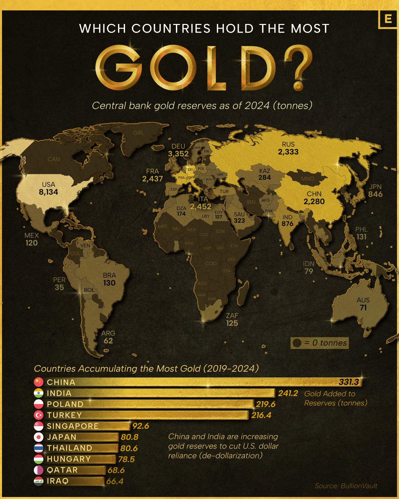
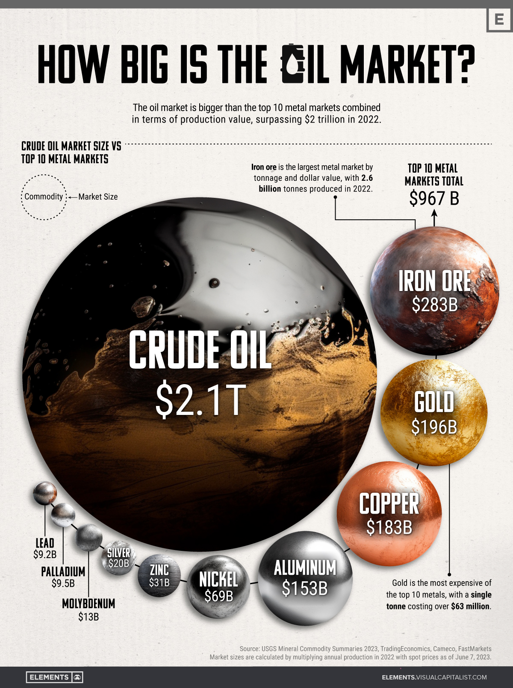
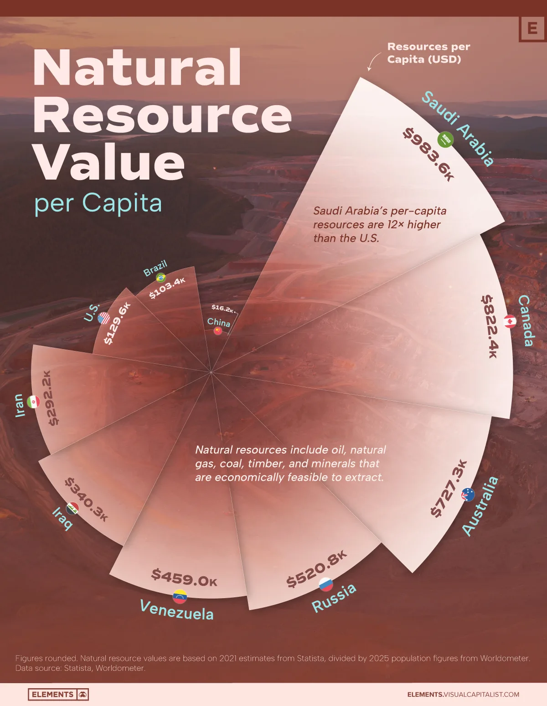

##### Image choice

> The image selection for this image redesign project was harder than expected. With every visit to [Elements](https://elements.visualcapitalist.com/) I found so many good images, a few of the candidates are displayed below.

::: {layout-nrow=2}
[{width=35%}](https://elements.visualcapitalist.com/where-chinese-evs-are-selling-the-most-worldwide/)

[{width=40%}](https://elements.visualcapitalist.com/mapped-which-countries-hold-the-most-gold/)

[{width=40%}](https://elements.visualcapitalist.com/sizing-up-the-oil-market-vs-top-10-metal-markets-combined/)

[{width=40%}](https://elements.visualcapitalist.com/the-worlds-top-resource-giants-ranked-by-wealth-per-capita/)
::: 

[Source: linked-figures (quarto docs)](https://quarto.org/docs/authoring/figures.html#linked-figures)  
[Source: figure-panels (quarto docs)](https://quarto.org/docs/authoring/figures.html#figure-panels)  
<!--  -->

  <!-- - [Chinas share of EV's world wide](https://elements.visualcapitalist.com/where-chinese-evs-are-selling-the-most-worldwide/)
  - [Central Bank Gold Reserves](https://elements.visualcapitalist.com/mapped-which-countries-hold-the-most-gold/)
  - [The Size of the Oil Market](https://elements.visualcapitalist.com/sizing-up-the-oil-market-vs-top-10-metal-markets-combined/)
  - [Natural Resource Value Per Capita](https://elements.visualcapitalist.com/the-worlds-top-resource-giants-ranked-by-wealth-per-capita/) -->
